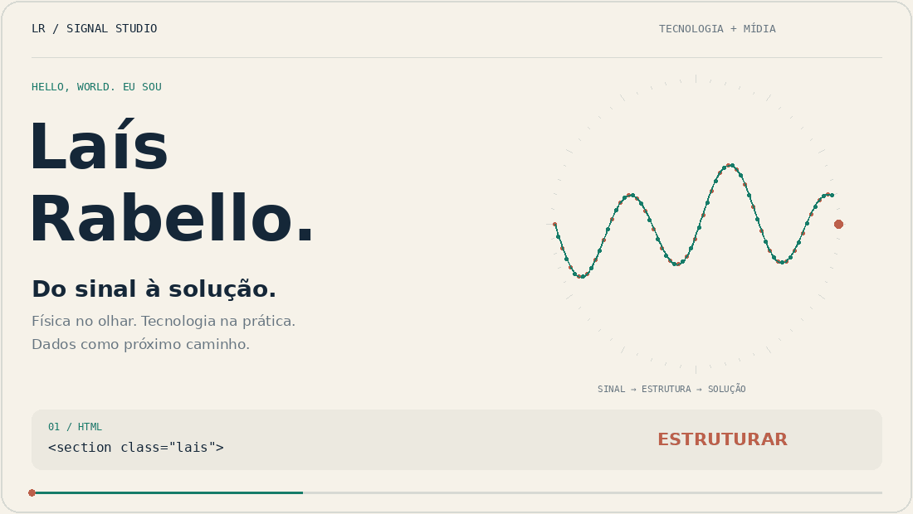
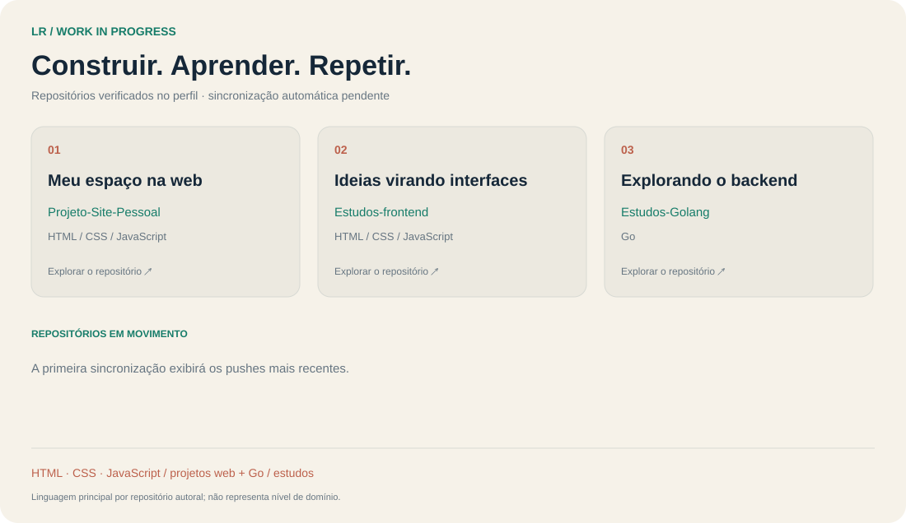

<picture>
  <source media="(prefers-color-scheme: dark)" srcset="./signal-dark.gif">
  
</picture>

  <a href="#minha-trajetória">Trajetória</a> ·
  <a href="#meu-trabalho">Projetos</a> ·
  <a href="https://www.linkedin.com/in/laispimentelrabello/">LinkedIn ↗</a>

### Minha trajetória

**Atualmente como Analista de Soluções de Mídia na Globo.**

Formada em Física, graduanda em Engenharia Elétrica e iniciando a formação em **Ciência de Dados na EBAC**. Meu ponto de encontro é a conexão entre tecnologia, dados e soluções de mídia.

<b>Abrir minha caixa de ferramentas</b>

| Construir | Analisar | Em estudo |
| --- | --- | --- |
| HTML, CSS e JavaScript | Excel e Power BI | Ciência de Dados na EBAC |
| Interfaces e projetos web | Métricas e KPIs | Python e SQL |
| Git e GitHub | Organização e interpretação de dados | Go: exercícios e resumos |

### Meu trabalho

<picture>
  <source media="(prefers-color-scheme: dark)" srcset="./work-dark.svg">
  
</picture>

  <a href="https://github.com/laisrabello/Projeto-Site-Pessoal"><b>01 / Portfólio ↗</b></a> &nbsp; · &nbsp;
  <a href="https://github.com/laisrabello/Estudos-frontend"><b>02 / Frontend ↗</b></a> &nbsp; · &nbsp;
  <a href="https://github.com/laisrabello/Estudos-Golang"><b>03 / Go ↗</b></a>

Sobre o Signal Studio · código e versão sem movimento

O sinal representa minha origem em Física; a transformação em interface representa meu trabalho com tecnologia; a conexão entre os dois acompanha minha evolução em mídia e dados. A animação é uma composição própria, desenhada quadro a quadro.

O painel abaixo da animação é gerado por **JavaScript**, a partir dos repositórios públicos do GitHub, e atualizado por GitHub Actions. Os dados são snapshots; não são uma transmissão em tempo real. Forks e este repositório de perfil ficam fora da lista de atividade e das contagens por linguagem.

[Ver composição estática](./signal-light.png) · [Ver gerador JavaScript](./source/update-profile.mjs) · [Ver fonte da animação](./source/render_motion.py)

